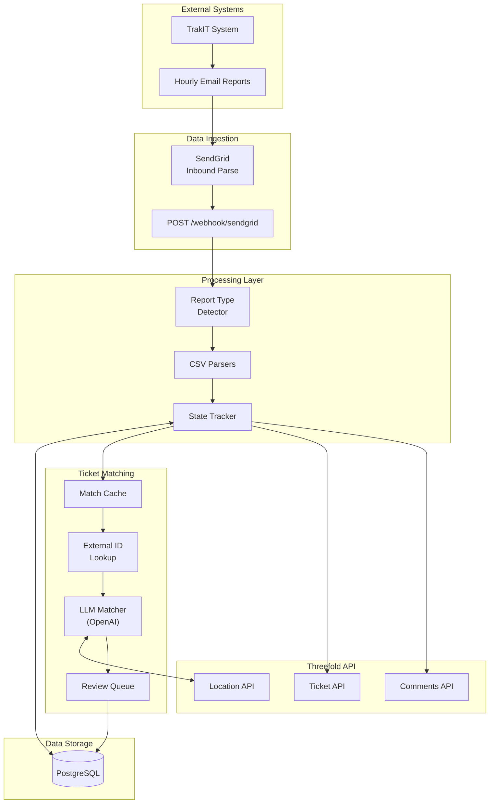
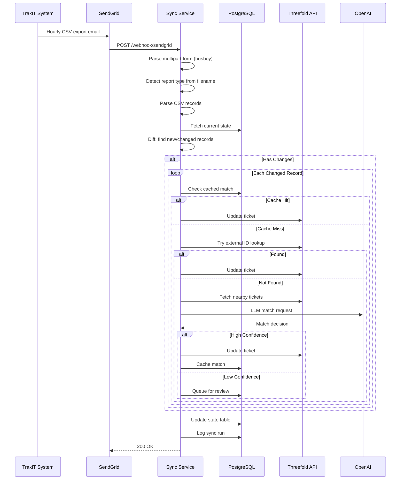
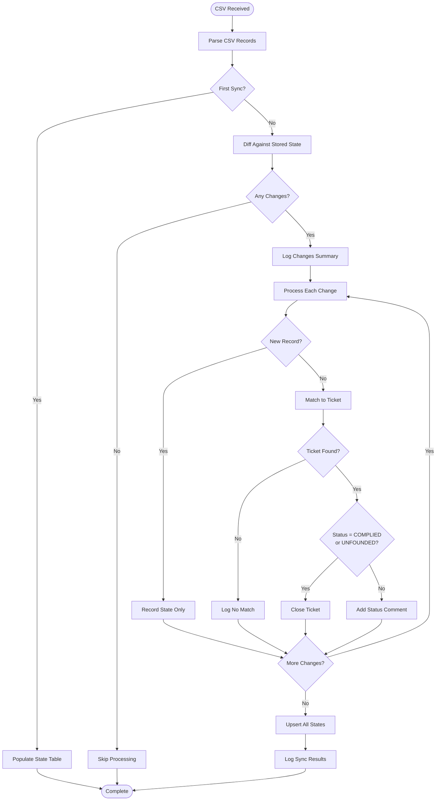
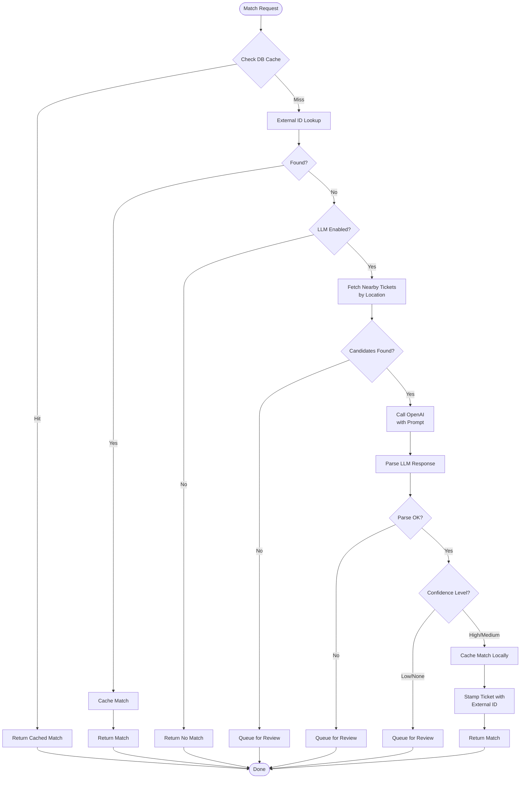
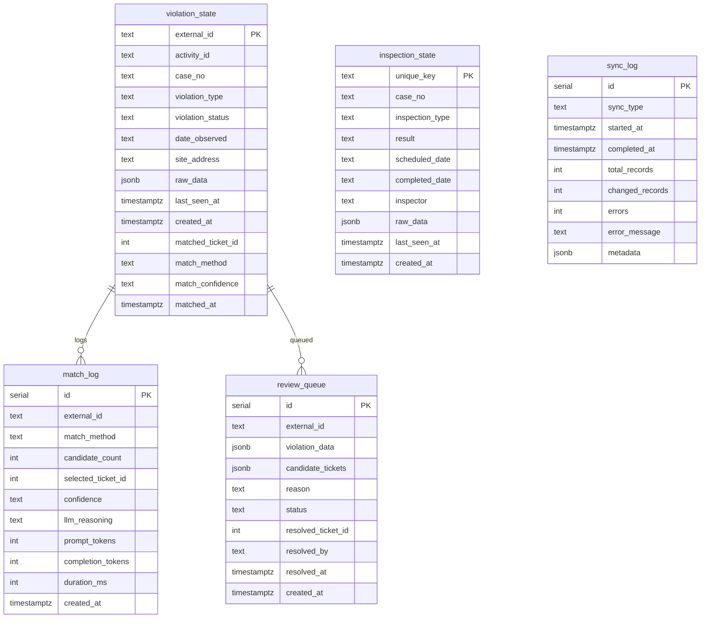
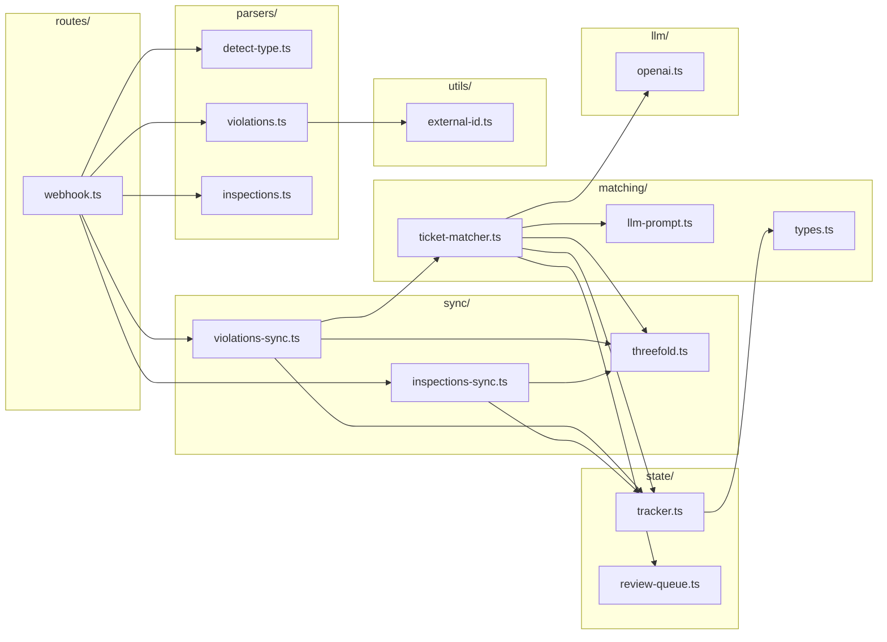

# corona-permit-sync

Corona Permit integration service - syncs permits from external systems to Threefold.

## Architecture Overview

### High-Level System Architecture



### Data Flow: Email to Ticket Update



### Violations Sync Flow



### LLM Ticket Matching Flow



### Database Schema



### Component Architecture



---

## What It Does

Receives hourly TrakIT email exports from Corona via SendGrid Inbound Parse, extracts CSV attachments (violations, inspections), parses them using TrakIT-specific column mappings, tracks the last-seen state of each record to detect changes, applies Corona's business rules to determine actions, and calls Threefold API to update tickets.

## Supported Reports

| Report | File Pattern | Action |
|--------|--------------|--------|
| Violations | `V_Threefold_Violations_and_Cases.csv` | Close ticket if COMPLIED/UNFOUNDED |
| Inspections | `V_Threefold_CASE_INSPECTIONS.csv` | Add comment to linked tickets |

## External ID Format

Violations are linked to Threefold tickets using this external ID format:

```
violation|{CASE_NO}|{Violation_Type}|{DATE_OBSERVED}

Example: "violation|CC24-1354|STAGNANT WATER|2024-08-27"
```

This format is:
- Readable for debugging
- Queryable with LIKE for case-based lookups (inspections)
- Deterministic (same input = same output)

## Setup

### 1. Railway Setup

1. Create a new project on Railway
2. Add a PostgreSQL database
3. Deploy this repo (connect GitHub)
4. Add environment variables (see below)

### 2. Environment Variables

```bash
# Server
PORT=3000
NODE_ENV=production

# Railway Postgres (auto-provided by Railway)
DATABASE_URL=postgresql://...

# Threefold API
THREEFOLD_API_URL=https://app.threefold.io
THREEFOLD_API_TOKEN=your-bearer-token
THREEFOLD_ORG_ID=corona-org-uuid

# Optional: OpenAI for LLM matching
OPENAI_API_KEY=sk-...
OPENAI_MODEL=gpt-4o-mini
LLM_MATCHING_ENABLED=true

# Matching config
MATCHING_RADIUS_METERS=100
MATCHING_LOOKBACK_DAYS=90

# Ticket updates (set to false for dry run)
TICKET_UPDATES_ENABLED=true
```

### 3. SendGrid Inbound Parse

1. Configure a subdomain MX record pointing to SendGrid
2. Set up Inbound Parse to POST to: `https://your-railway-app.up.railway.app/webhook/sendgrid`
3. Configure TrakIT to send hourly exports to the inbound email address

## Development

```bash
# Install dependencies
npm install

# Run locally (requires DATABASE_URL)
npm run dev

# Type check
npm run typecheck

# Build
npm run build
```

## API Endpoints

| Endpoint | Method | Description |
|----------|--------|-------------|
| `/health` | GET | Health check |
| `/webhook/sendgrid` | POST | SendGrid Inbound Parse webhook |

## Database Schema

The service uses Railway Postgres to track state:

- `violation_state` - Last-seen state of each violation
- `inspection_state` - Last-seen state of each inspection
- `sync_log` - Audit log of sync runs
- `review_queue` - Manual review queue for uncertain matches
- `match_log` - Audit log of LLM matching decisions

## Threefold Integration

This service calls Threefold's external API:

- `GET /api/external/ticket-by-reference` - Find ticket by external ID
- `GET /api/external/tickets-by-reference-pattern` - Find tickets by case number
- `POST /api/external/tickets/by-location` - Find tickets near an address
- `POST /api/change-status/external` - Update ticket status
- `POST /api/change-step/external` - Move ticket to workflow step
- `POST /api/comments/external` - Add comment to ticket
- `POST /api/update-external-reference/external` - Stamp ticket with external ID

## Status Mappings

### Violations

| TrakIT Status | Threefold Action |
|---------------|------------------|
| `COMPLIED` | Close ticket |
| `UNFOUNDED` | Close ticket |
| Other | Add status change comment |

### Inspections

All inspection changes add a comment to linked tickets with inspection details.

## Ticket Matching Strategy

The service uses a multi-tier matching strategy:

1. **Cache Check** - Fast path for previously matched violations
2. **External ID Lookup** - Direct lookup if ticket already stamped
3. **LLM Matching** - Uses GPT-4o-mini to match by location + context
4. **Review Queue** - Low-confidence matches queued for manual review
